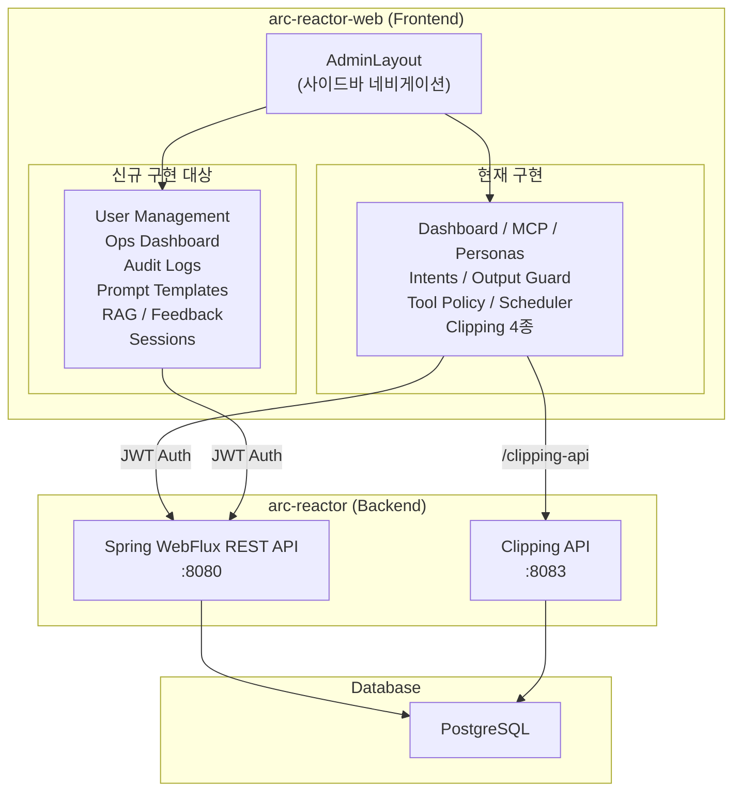
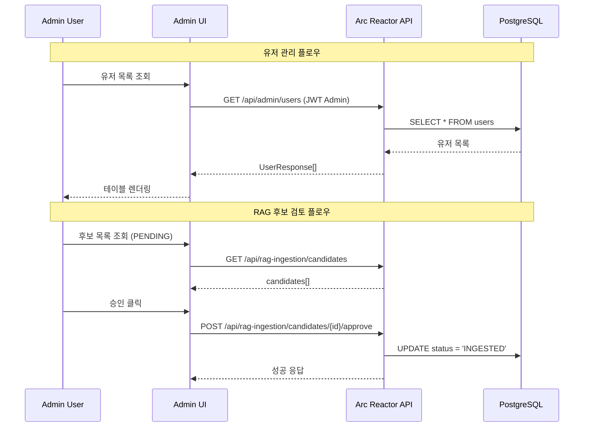
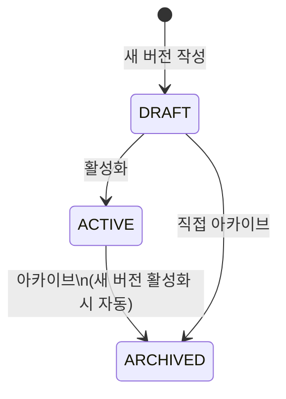

# Arc Reactor Admin Panel — Product Requirements Document

**작성자**: Engineering Team
**상태**: Draft
**작성일**: 2026-02-18
**마지막 업데이트**: 2026-02-18
**검토자**: CTO, Engineering Lead

---

## 1. 개요 (Overview)

Arc Reactor는 MCP(Model Context Protocol) 기반 AI Agent 플랫폼으로, 운영자가 AI 에이전트의 동작·안전 정책·자동화 작업을 중앙에서 제어할 수 있는 Admin Panel을 제공한다.

본 문서는 현재 구현 상태를 파악하고, 백엔드에 이미 존재하지만 Admin UI에 없는 기능들을 우선순위와 함께 정의하여 구현 로드맵을 수립하는 것을 목적으로 한다.

---

## 2. 현재 구현 상태 (Current State)

### 2.1 기술 스택

| 영역 | 기술 |
|------|------|
| Frontend | React 19, TypeScript 5.9, Vite 7, React Router v7 |
| 서버 상태 | TanStack Query v5 |
| 클라이언트 상태 | Zustand v5 |
| HTTP 클라이언트 | ky v1 |
| 폼 | react-hook-form v7 + zod v4 |
| Backend | Kotlin, Spring Boot 3.5 (WebFlux), Spring AI |
| DB | PostgreSQL (Flyway 마이그레이션 19개) |
| 인증 | JWT Bearer Token |
| 다국어 | i18next (한국어/영어) |

### 2.2 Admin UI 현재 구현 기능

```
/admin
├── /                      ✅ Dashboard (MCP 서버 상태 요약)
├── /mcp-servers           ✅ MCP 서버 관리 (CRUD + 연결/해제)
├── /personas              ✅ 페르소나 관리 (CRUD)
├── /intents               ✅ 인텐트 관리 (CRUD)
├── /output-guard          ✅ 출력 가드 룰 관리 (CRUD + 시뮬레이션)
├── /tool-policy           ✅ 툴 정책 관리
├── /scheduler             ✅ 스케줄러 잡 관리 (CRUD + 즉시 실행)
├── /clipping/categories   ✅ 클리핑 카테고리 관리
├── /clipping/sources      ✅ 클리핑 소스 관리 (검증/승인)
├── /clipping/personas     ✅ 클리핑 페르소나 관리
└── /clipping/stats        ✅ 클리핑 통계 (읽기 전용)
```

### 2.3 백엔드 API 현황

- 총 **20개 Controller**, **80+ REST 엔드포인트** (50+ 는 Admin 전용)
- 총 **14개 DB 테이블**, **19개 Flyway 마이그레이션**

---

## 3. 갭 분석 (Gap Analysis)

기능별로 백엔드/API/UI 준비 상태가 다르므로, 아래 표를 기준으로 구현 범위를 정의한다.

| 기능 | 백엔드 상태 | API 상태 | 현재 UI 상태 | 우선순위 |
|------|------------|---------|--------------|---------|
| 유저 관리 | `users` 테이블 + `AuthController` 존재 | Admin 전용 API 없음 (신규 필요) | 없음 | P0 |
| 운영 대시보드 (Ops Metrics) | `OpsDashboardController` 존재 | 기존 API 활용 가능 | 기존 Dashboard는 MCP 요약만 표시 | P0 |
| 어드민 감사 로그 | `AdminAuditController` 존재 | 기존 API 활용 가능 | 없음 | P0 |
| 프롬프트 템플릿 버전 관리 | `PromptTemplateController` 존재 | 기존 API 활용 가능 | Settings 패널에 부분 구현, Admin 페이지 없음 | P1 |
| RAG 수집 정책 | `RagIngestionPolicyController` 존재 | 기존 API 활용 가능 | 없음 | P1 |
| RAG 수집 후보 검토 | `RagIngestionCandidateController` 존재 | 기존 API 활용 가능 | 없음 | P1 |
| 피드백 관리 및 분석 | `FeedbackController` 존재 | 기존 API 활용 가능 | 없음 | P1 |
| 세션 관리 | `SessionController` 존재 | 기존 API 활용 가능 | 없음 | P2 |
| 툴 승인 워크플로우 | `ApprovalController` 존재 | 기존 API 활용 가능 (`/api/approvals`) | 채팅 영역 배너에 부분 구현, Admin 페이지 없음 | P2 |
| LLM 모델 현황 | `/api/models` 존재 | 기존 API 활용 가능 | 로그인 가드 확인용으로만 사용, Admin 현황 페이지 없음 | P2 |

---

## 4. 아키텍처 다이어그램

### 4.1 Admin 시스템 전체 구조



### 4.2 신규 기능 데이터 흐름



---

## 5. 신규 기능 요구사항

### 5.1 [P0] 유저 관리 (User Management)

**문제**: 현재 Admin UI에서 사용자 계정을 조회·관리할 방법이 없다. 운영 중 권한 변경이나 계정 비활성화가 불가하다.

**목표**: 운영자가 사용자 계정의 목록 조회, 역할 변경, 상태 관리를 할 수 있는 페이지.

#### 요구 기능

| 기능 | 설명 | API |
|------|------|-----|
| 유저 목록 조회 | 이메일, 이름, 역할, 생성일 표시 | `GET /api/admin/users` *(신규 필요)* |
| 역할 변경 | USER ↔ ADMIN 전환 | `PUT /api/admin/users/{id}/role` *(신규 필요)* |
| 계정 비활성화 | 로그인 차단 | `PUT /api/admin/users/{id}/status` *(신규 필요)* |
| 비밀번호 초기화 | 임시 비밀번호 발급 | `POST /api/admin/users/{id}/reset-password` *(신규 필요)* |

> **참고**: 백엔드 `users` 테이블과 `AuthController`가 존재하지만, Admin용 엔드포인트가 없어 백엔드 API 추가 개발이 필요하다.

#### 화면 구성

```
┌─────────────────────────────────────────────────────────────┐
│  User Management                              [+ Invite]    │
├─────────────────────────────────────────────────────────────┤
│  Search: [____________]  Role: [All ▼]  Status: [All ▼]    │
├────────────┬───────────┬────────┬────────────┬─────────────┤
│  Email     │  Name     │  Role  │  Created   │  Actions    │
├────────────┼───────────┼────────┼────────────┼─────────────┤
│  a@b.com   │  Alice    │  ADMIN │  2025-01   │ [Edit][Ban] │
│  c@d.com   │  Bob      │  USER  │  2025-03   │ [Edit][Ban] │
└────────────┴───────────┴────────┴────────────┴─────────────┘
```

---

### 5.2 [P0] 운영 대시보드 고도화 (Ops Dashboard)

**문제**: 현재 Dashboard는 MCP 서버 연결 상태만 표시한다. 백엔드의 `OpsDashboardController`가 풍부한 운영 메트릭을 제공하지만 활용되지 않고 있다.

**목표**: 시스템 전반의 실시간 운영 상태를 한눈에 파악하는 통합 대시보드.

#### 표시 메트릭

| 섹션 | 메트릭 | API |
|------|--------|-----|
| 시스템 요약 | 총 채팅 수, 활성 세션, 오늘의 요청 | `GET /api/ops/dashboard` |
| MCP 서버 상태 | 연결/미연결/오류 수 | *(기존 구현)* |
| 피드백 현황 | 긍정/부정 비율, 최근 7일 트렌드 | `GET /api/feedback` |
| 스케줄러 현황 | 실행 중/성공/실패 잡 수 | `GET /api/scheduler/jobs` |
| 감사 로그 | 최근 어드민 액션 5건 | `GET /api/admin/audits` |

#### 화면 구성

```
┌────────────────────────────────────────────────────────────┐
│  Ops Dashboard                          Last updated: now  │
├──────────────┬──────────────┬─────────────┬───────────────┤
│  Total Chats │ Active Users │ Success Rate│  Avg Latency  │
│    12,483    │     47       │    98.2%    │    342ms      │
├──────────────┴──────────────┴─────────────┴───────────────┤
│  [Feedback Trend - 7 days Chart]                           │
├────────────────────────────┬───────────────────────────────┤
│  Scheduler Jobs            │  Recent Admin Actions         │
│  ✅ 8 Success  ❌ 1 Failed │  • Persona updated by admin   │
│  ⏸ 2 Disabled             │  • MCP server connected        │
└────────────────────────────┴───────────────────────────────┘
```

---

### 5.3 [P0] 감사 로그 (Admin Audit Logs)

**문제**: 백엔드에 불변(immutable) 감사 로그 테이블(`admin_audits`)이 존재하지만 UI가 없어 컴플라이언스 요구를 충족할 수 없다.

**목표**: 모든 어드민 액션의 히스토리를 조회·필터링할 수 있는 페이지.

#### 요구 기능

| 기능 | 설명 | API |
|------|------|-----|
| 로그 목록 조회 | 카테고리, 액션, 액터, 리소스, 시간 표시 | `GET /api/admin/audits` |
| 필터링 | 카테고리, 액터, 날짜 범위로 필터 | 쿼리 파라미터 |
| 상세 보기 | detail 필드 JSON 뷰어 | 클라이언트 사이드 |
| 내보내기 | CSV 다운로드 | 클라이언트 사이드 변환 |

#### 화면 구성

```
┌─────────────────────────────────────────────────────────────┐
│  Audit Logs                                    [Export CSV] │
├─────────────────────────────────────────────────────────────┤
│  Category: [All ▼]  Actor: [______]  Date: [__] ~ [__]     │
├──────────┬──────────┬────────┬─────────────┬───────────────┤
│  Time    │ Category │ Action │  Actor      │  Resource     │
├──────────┼──────────┼────────┼─────────────┼───────────────┤
│ 14:32:01 │ PERSONA  │ UPDATE │ admin@co.kr │ persona:3     │
│ 14:28:44 │ MCP      │ CONNECT│ admin@co.kr │ server:slack  │
│ 13:55:12 │ POLICY   │ UPDATE │ admin@co.kr │ tool-policy   │
└──────────┴──────────┴────────┴─────────────┴───────────────┘
```

---

### 5.4 [P1] 프롬프트 템플릿 버전 관리 (Prompt Template Versioning)

**문제**: 백엔드의 `PromptTemplate` + `PromptVersion` (DRAFT/ACTIVE/ARCHIVED)은 구현되어 있고, 프론트에도 `src/components/settings/PromptTemplateManager.tsx`에서 템플릿/버전 관리가 부분 구현되어 있다. 다만 채팅 UI의 설정 패널 전용이어서 Admin IA, 운영 필터/검색, 접근성 있는 롤백 UX, 감사 가능한 운영 워크플로우를 충족하지 못한다.

**목표**: 프롬프트 템플릿의 버전을 관리하고, 안전하게 배포/롤백할 수 있는 워크플로우 제공.

#### 요구 기능

| 기능 | 설명 | API |
|------|------|-----|
| 템플릿 목록 | 이름, 설명, 현재 활성 버전 표시 | `GET /api/prompt-templates` |
| 버전 히스토리 | 버전별 내용·상태·날짜 | `GET /api/prompt-templates/{id}` |
| 새 버전 작성 | DRAFT 상태로 생성 | `POST /api/prompt-templates/{id}/versions` |
| 버전 활성화 | DRAFT → ACTIVE (이전 ACTIVE는 자동 ARCHIVED) | `PUT /api/prompt-templates/{id}/versions/{vid}/activate` |
| 버전 아카이브 | ACTIVE → ARCHIVED | `PUT /api/prompt-templates/{id}/versions/{vid}/archive` |
| 버전 비교 | diff 뷰로 이전/현재 버전 비교 | 클라이언트 사이드 |

#### 상태 흐름



---

### 5.5 [P1] RAG 수집 정책 및 후보 검토 (RAG Ingestion)

**문제**: RAG(Retrieval-Augmented Generation) 시스템의 데이터 수집 정책과 Human-in-the-loop 검토 워크플로우가 백엔드에 존재하지만 UI가 없어 운영자가 RAG 품질을 통제할 수 없다.

**목표**: RAG 수집 설정 관리 및 수집 후보 승인/거절 워크플로우 제공.

#### 5.5.1 RAG 정책 설정

| 설정 항목 | 설명 | API |
|-----------|------|-----|
| 수집 활성화 여부 | 전체 RAG 수집 ON/OFF | `PUT /api/rag-ingestion/policy` |
| 검토 필요 여부 | 자동 수집 vs 검토 후 수집 | |
| 허용 채널 | RAG 수집 대상 채널 화이트리스트 | |
| 최소 쿼리 길이 | 너무 짧은 쿼리 제외 | |
| 차단 패턴 | 수집 제외 패턴 (regex) | |

#### 5.5.2 수집 후보 검토

| 기능 | 설명 | API |
|------|------|-----|
| 후보 목록 | PENDING 상태 후보 표시 | `GET /api/rag-ingestion/candidates` |
| 내용 미리보기 | 쿼리 + AI 응답 확인 | |
| 승인 | Vector Store에 자동 수집 | `POST /api/rag-ingestion/candidates/{id}/approve` |
| 거절 | 거절 사유 입력 후 제외 | `POST /api/rag-ingestion/candidates/{id}/reject` |
| 일괄 처리 | 복수 선택 후 일괄 승인/거절 | 클라이언트 배치 |

#### 화면 구성

```
┌─────────────────────────────────────────────────────────────┐
│  RAG Ingestion Candidates              [Bulk Approve] [Bulk Reject] │
├─────────────────────────────────────────────────────────────┤
│  Status: [PENDING ▼]  Channel: [All ▼]                      │
├──┬─────────────────────────────────┬────────────┬──────────┤
│☐ │ Query (preview)                 │  Channel   │ Actions  │
├──┼─────────────────────────────────┼────────────┼──────────┤
│☐ │ "Kubernetes 배포 방법은?"       │ #dev-team  │ [✓][✗]  │
│☐ │ "JWT 인증 방식 비교"            │ #backend   │ [✓][✗]  │
└──┴─────────────────────────────────┴────────────┴──────────┘
```

---

### 5.6 [P1] 피드백 관리 및 분석 (Feedback Management)

**문제**: 사용자 피드백 데이터(thumbs up/down + 실행 메타데이터)가 백엔드에 수집되고 있으나, 운영자가 이를 분석하거나 AI 품질 개선에 활용할 방법이 없다.

**목표**: 피드백 데이터의 조회·분석·내보내기 기능으로 AI 품질 개선 루프 완성.

#### 요구 기능

| 기능 | 설명 | API |
|------|------|-----|
| 피드백 목록 | rating, 인텐트, 모델, 소요시간 등 표시 | `GET /api/feedback` |
| 필터링 | rating, 날짜, 인텐트, 도메인별 | 쿼리 파라미터 |
| 상세 보기 | 쿼리·응답·사용된 툴 전체 내용 | `GET /api/feedback/{id}` |
| 삭제 | 개인정보 포함 피드백 삭제 | `DELETE /api/feedback/{id}` |
| 내보내기 | eval-testing 포맷으로 JSON 내보내기 | `GET /api/feedback/export` |
| 분석 차트 | 긍정/부정 비율, 인텐트별 만족도, 트렌드 | 클라이언트 집계 |

#### 분석 대시보드 구성

```
┌──────────────────────────────────────────────────────────────┐
│  Feedback Analytics                           [Export JSON]  │
├────────────────┬─────────────────┬────────────────┬─────────┤
│  Total         │  👍 Positive    │  👎 Negative   │  Avg    │
│    1,247       │  1,089 (87.3%)  │   158 (12.7%)  │  4.2★  │
├────────────────┴─────────────────┴────────────────┴─────────┤
│  [7-day Trend Chart]          │  [Intent별 만족도 Bar Chart] │
├────────────────────────────────────────────────────────────┤
│  Recent Negative Feedback                                   │
│  • "답변이 부정확합니다" — intent: tech-support — gpt-4o   │
│  • "툴 실행 오류" — intent: automation — claude-3-5-sonnet  │
└────────────────────────────────────────────────────────────┘
```

---

### 5.7 [P2] 세션 관리 (Session Management)

**문제**: 운영자가 특정 사용자의 대화 세션을 조회하거나 문제 있는 세션을 삭제할 방법이 없다.

**목표**: 대화 세션 조회, 내용 확인, 필요 시 삭제 기능 제공.

#### 요구 기능

| 기능 | 설명 | API |
|------|------|-----|
| 세션 목록 | 사용자별 세션 목록, 최근 메시지, 메시지 수 | `GET /api/sessions` |
| 세션 상세 | 전체 대화 내용 조회 | `GET /api/sessions/{id}` |
| 내보내기 | JSON 또는 Markdown으로 내보내기 | `GET /api/sessions/{id}/export?format=json\|markdown` |
| 세션 삭제 | 개인정보 요청 등에 대응한 삭제 | `DELETE /api/sessions/{id}` |

---

### 5.8 [P2] 툴 승인 워크플로우 (Tool Approval Workflow)

**문제**: `ApprovalController` 및 승인 API는 존재하고 채팅 화면의 `ApprovalBanner`에서 일부 동작하지만, Admin 운영자가 요청을 한곳에서 관리할 수 있는 전용 페이지가 없다.

**목표**: 승인 대기 중인 툴 실행 요청을 실시간으로 검토·승인·거절하는 UI 제공.

#### 요구 기능

| 기능 | 설명 | API/기술 |
|------|------|-----------|
| 승인 대기 목록 | PENDING 상태 툴 실행 요청 표시 | `GET /api/approvals` |
| 요청 상세 | 툴 이름, 인자, 요청자, 요청 시각 확인 | 목록 응답 필드 활용 |
| 승인 | 1-click 승인 | `POST /api/approvals/{id}/approve` |
| 거절 | 사유 입력 후 거절 | `POST /api/approvals/{id}/reject` |
| 실시간 갱신 | 신규 요청 반영 | MVP: 폴링(2초), 추후 SSE/WebSocket 확장 검토 |
| 알림 | 새 승인 요청 시 브라우저 알림 | Web Notifications API |

---

## 6. 기술 구현 가이드

### 6.1 공통 패턴

신규 Admin 페이지는 기존 코드 패턴을 따른다:

```
src/
├── components/admin/pages/
│   └── {FeatureName}Page.tsx      # 신규 어드민 페이지
├── hooks/
│   └── use{FeatureName}.ts        # TanStack Query 훅 (useQuery / useMutation)
├── schemas/
│   └── {feature-name}.ts          # Zod 스키마 및 폼 타입
├── services/
│   └── {feature-name}.ts          # ky 기반 API 서비스 레이어
└── types/
    └── api.ts                     # 타입 추가 (기존 파일 확장)
```

> **참고**: `src/components/settings/`의 `*Manager.tsx` 컴포넌트는 채팅 UI 내 슬라이드 설정 패널 전용이다. 신규 어드민 페이지는 `components/admin/pages/`에만 추가한다.

### 6.2 AdminLayout 네비게이션 추가

`src/components/admin/AdminLayout.tsx`의 `navItems` 배열에 신규 항목 추가. 현재 구조는 `{ to, label, end? }` 형태이며 아이콘 라이브러리를 사용하지 않는다:

```tsx
// 기존 구조에 추가
const navItems = [
  // ... 기존 항목들
  { to: '/admin/users',            label: t('admin.nav.users') },
  { to: '/admin/audit-logs',       label: t('admin.nav.auditLogs') },
  { to: '/admin/prompt-templates', label: t('admin.nav.promptTemplates') },
  { to: '/admin/rag',              label: t('admin.nav.rag') },
  { to: '/admin/feedback',         label: t('admin.nav.feedback') },
  { to: '/admin/sessions',         label: t('admin.nav.sessions') },
  { to: '/admin/approvals',        label: t('admin.nav.approvals') },
]
```

i18n 키는 `src/i18n/` 로케일 파일(en, ko)에 함께 추가한다.

### 6.3 라우팅 추가

`src/App.tsx`에 신규 라우트 추가:

```tsx
<Route path="/admin" element={<AdminLayout />}>
  {/* 기존 라우트 */}
  {/* 신규 라우트 */}
  <Route path="users"             element={<UserManagementPage />} />
  <Route path="audit-logs"        element={<AuditLogsPage />} />
  <Route path="prompt-templates"  element={<PromptTemplatesPage />} />
  <Route path="rag"               element={<RagIngestionPage />} />
  <Route path="feedback"          element={<FeedbackPage />} />
  <Route path="sessions"          element={<SessionsPage />} />
  <Route path="approvals"         element={<ApprovalWorkflowPage />} />
</Route>
```

### 6.4 백엔드 신규 API 필요 목록

| 기능 | 필요한 신규 API | 비고 |
|------|----------------|------|
| 유저 관리 | `GET /api/admin/users` | 백엔드 신규 개발 필요 |
| 유저 관리 | `PUT /api/admin/users/{id}/role` | 백엔드 신규 개발 필요 |
| 유저 관리 | `PUT /api/admin/users/{id}/status` | 백엔드 신규 개발 필요 |
| 유저 관리 | `POST /api/admin/users/{id}/reset-password` | 백엔드 신규 개발 필요 |
| 나머지 모두 | 기존 API 활용 | 프론트엔드 중심 개발 (단, 페이징/정렬/필터 스펙은 백엔드와 고정 필요) |

### 6.5 리스트 페이지 공통 NFR (필수)

감사 로그, RAG 후보, 피드백, 세션, 유저 목록은 동일한 대용량 데이터 처리 기준을 따른다.

| 항목 | 기준 |
|------|------|
| 페이지네이션 | 서버 사이드 페이지네이션 필수 (`page`, `size`) |
| 기본 페이지 크기 | `size=20` 기본, `size` 최대 100 |
| 정렬 | `sort=createdAt,desc` 기본 (기능별 예외 명시) |
| 필터 | URL 쿼리 파라미터로 상태 보존 (새로고침/공유 가능) |
| 상태 처리 | Loading / Error / Empty 상태를 모든 목록 페이지에 구현 |
| CSV/JSON 내보내기 | 현재 필터 조건 기준으로 내보내기 |
| 접근 제어 | Admin 권한 검증 실패 시 라우트 접근 차단 |

### 6.6 테스트 및 수용 기준 (Definition of Done)

기능 완료의 최소 기준:

- `pnpm lint` 통과
- 신규 `use<Domain>.ts` 훅 단위 테스트 추가/통과
- 라우팅 또는 인증 플로우 변경 시 E2E 시나리오 추가/통과
- i18n 키(en/ko) 누락 없음
- 삭제/권한 변경/승인·거절 같은 위험 액션은 확인 UI + 오류 메시지 처리 포함

### 6.7 개발 문서 위치 및 언어 정책

Admin 기능 개발 문서는 `docs/` 아래에 관리하며, `arc-reactor/docs`와 동일한 이중 언어 구조를 따른다.

- 문서 루트: `docs/`
- 언어 디렉터리: `docs/en`, `docs/ko`
- 동일 문서는 en/ko에 동일한 경로/파일명으로 페어 관리
- 인덱스 문서(`README.md`)에서 도메인별 문서 링크를 유지
- 기능 구현 완료 시 최소한 아래 문서를 en/ko로 동시 반영
  - API 계약(요청/응답/에러 코드)
  - 운영 가이드(권한, 승인/거절, 롤백 절차)
  - 테스트/검증 체크리스트

권장 도메인 분류(예시):

- `docs/en/engineering`, `docs/ko/engineering`: 테스트 전략, 개발/운영 절차
- `docs/en/governance`, `docs/ko/governance`: 정책, 승인, 감사 관련 운영 문서
- `docs/en/reference`, `docs/ko/reference`: 엔드포인트/필드/메트릭 참조

### 6.8 Admin UI/브랜딩 정책

신규 Admin 화면은 기존 프로젝트의 브랜드/디자인 방향을 유지하면서, 운영 도구 특성에 맞는 Toss 스타일 UX를 적용한다.

| 항목 | 정책 |
|------|------|
| UI 스타일 | Toss 스타일 기반의 단순하고 명확한 정보 위계(카드/리스트 중심, 충분한 여백, 명확한 CTA) |
| 브랜드 컬러 | 현재 프로젝트에서 사용하는 브랜드 컬러 토큰/변수를 그대로 사용 (신규 임의 팔레트 도입 금지) |
| 컴포넌트 일관성 | 기존 Admin/Layout 컴포넌트 패턴 우선 재사용, 신규 컴포넌트도 동일한 시각 규칙 준수 |
| 상태 표현 | 성공/경고/오류 상태는 기존 프로젝트 상태 컬러 규칙을 따른다 |
| 접근성 | 색상만으로 상태를 전달하지 않고 텍스트/아이콘/레이블을 함께 제공 |

UI 구현 완료 기준(추가):

- 기존 화면 대비 시각적 톤 불일치 없음 (브랜드 컬러/타이포/간격 체계 일치)
- 관리자 주요 작업(조회/필터/수정/승인)에서 3-click 이내 도달 가능한 정보 구조 유지

### 6.9 Admin UI 컴포넌트 체크리스트 템플릿

기능 단위 PR마다 아래 템플릿을 복사해 점검한다.

```md
## Admin UI Checklist

Feature/Page: [페이지명]
Route: [/admin/...]
PR: [링크]

### 1) Design & Branding
- [ ] Toss 스타일 정보 위계(헤더/요약/목록/상세)가 명확하다.
- [ ] 프로젝트 브랜드 컬러 토큰/변수만 사용했다.
- [ ] 기존 Admin 컴포넌트 시각 규칙(간격/테두리/버튼 톤)과 일치한다.
- [ ] 모바일(최소 360px)과 데스크톱에서 레이아웃이 깨지지 않는다.

### 2) UX & Accessibility
- [ ] Loading / Error / Empty 상태를 모두 제공한다.
- [ ] 위험 액션(삭제/승인/권한변경)에 확인 UI를 제공한다.
- [ ] 색상 외 텍스트/아이콘/레이블로 상태를 함께 전달한다.
- [ ] 키보드 접근(포커스 이동/엔터 실행)과 기본 a11y 속성을 확인했다.

### 3) Data & Architecture
- [ ] 컴포넌트에서 직접 fetch 호출이 없다 (`services` + `hooks` 경유).
- [ ] TanStack Query 훅(`useQuery`/`useMutation`)으로 서버 상태를 처리한다.
- [ ] Query key는 `src/lib/queryKeys.ts`를 사용한다.
- [ ] 폼은 `react-hook-form` + `zod` 스키마를 사용한다.
- [ ] 목록 API는 `page/size/sort` 및 필터 파라미터를 준수한다.

### 4) i18n & Docs
- [ ] 사용자 노출 문구에 하드코딩이 없고 i18n 키(en/ko)를 추가했다.
- [ ] 개발 문서를 `docs/en`, `docs/ko`에 같은 경로로 반영했다.
- [ ] API 계약/운영 가이드/테스트 체크리스트 문서가 업데이트되었다.

### 5) Test & Verification
- [ ] `pnpm lint` 통과
- [ ] 관련 단위 테스트(훅/컴포넌트) 추가 및 통과
- [ ] 라우트/인증 변경 시 E2E 시나리오 추가 및 통과
- [ ] Admin 권한 가드 회귀가 없음을 확인했다.
```

---

## 7. 대안 검토 (Alternatives Considered)

### Option A: 기존 Admin Panel 점진적 확장 (권장)

기존 `arc-reactor-web`의 Admin 구조를 그대로 활용하여 신규 페이지를 추가한다.

**장점**: 일관된 UX, 재사용 가능한 컴포넌트, 빠른 개발 속도
**단점**: 페이지 수가 늘어날수록 사이드바 네비게이션 복잡도 증가
**결정**: 채택 — 기존 패턴을 유지하되 네비게이션 그룹핑 추가

### Option B: 별도 Admin SPA 분리

Admin 기능을 독립적인 Vite 앱(`arc-reactor-admin`)으로 분리한다.

**장점**: 독립적인 빌드/배포, 번들 크기 최적화
**단점**: 코드 중복, 공유 컴포넌트 관리 복잡, 추가 인프라 필요
**결정**: 기각 — 현재 규모에서 오버엔지니어링

### Option C: 기존 오픈소스 Admin 프레임워크 사용 (react-admin 등)

**장점**: 검증된 UI, 빠른 초기 셋업
**단점**: 기존 커스텀 컴포넌트와 통합 난이도, i18n/테마 충돌
**결정**: 기각 — 기존 코드베이스와의 통합 비용이 더 큼

---

## 8. 리스크 및 완화 방안

| 리스크 | 심각도 | 가능성 | 완화 방안 |
|--------|--------|--------|-----------|
| 유저 관리 API 백엔드 미개발 | High | High | 백엔드 팀과 API 스펙 선정 후 병렬 개발 |
| 감사 로그 데이터 양 과다로 UI 느려짐 | Medium | Medium | 페이지네이션 + 날짜 필터 필수 적용 |
| 피드백/세션 목록 대용량 조회 시 성능 저하 | Medium | Medium | 공통 NFR(서버 페이징/정렬/필터) 강제 적용 |
| FE-BE 쿼리 파라미터 스펙 불일치 | High | Medium | OpenAPI/예시 요청-응답 계약서 먼저 고정 |
| RAG 일괄 승인 시 Vector Store 부하 | Medium | Low | 배치 처리 + 백그라운드 큐 방식 권고 |
| 세션 삭제 시 개인정보 처리 규정 위반 | High | Low | 삭제 전 확인 다이얼로그 + 감사 로그 기록 |
| 툴 승인 실시간 알림 구현 복잡도 | Low | Medium | MVP 폴링(2초) 우선, 이후 SSE/WebSocket 점진 도입 |

---

## 9. 성공 지표 (Success Metrics)

| 지표 | 현재 | 목표 | 측정 방법 |
|------|------|------|-----------|
| Admin 기능 커버리지 | 11/21 (52%) | 21/21 (100%) | 백엔드 API 대비 UI 페이지 수 |
| 운영 이슈 평균 대응 시간 | 측정 불가 | < 5분 | Ops Dashboard를 통한 이상 감지 |
| RAG 수집 후보 처리율 | 0% (UI 없음) | > 80% 주간 처리 | 후보 PENDING → 처리 전환율 |
| 피드백 부정 비율 | 측정 불가 | < 15% | Feedback Analytics |
| 감사 로그 추적 가능성 | 0% (UI 없음) | 100% Admin 액션 추적 | Audit Logs 커버리지 |

---

## 10. 구현 로드맵

### Phase 1 — 운영 필수 기능 (P0) · 2주

```
Week 1
├── Ops Dashboard 고도화 (백엔드 API 연동 + 차트)
└── 감사 로그 페이지

Week 2
└── 유저 관리 페이지 (백엔드 API 개발과 병렬)
```

### Phase 2 — 품질 관리 기능 (P1) · 3주

```
Week 3
└── 프롬프트 템플릿 버전 관리

Week 4
├── RAG 수집 정책 관리
└── RAG 수집 후보 검토 워크플로우

Week 5
└── 피드백 관리 및 분석 대시보드
```

### Phase 3 — 고급 운영 기능 (P2) · 2주

```
Week 6
└── 세션 관리

Week 7
└── 툴 승인 워크플로우 (실시간 알림 포함)
```

---

## 11. 개발 진행 및 PR 운영 원칙

본 문서 기반 개발은 아래 워크플로우를 필수로 따른다.

1. **브랜치 생성 후 작업**
   - 모든 구현 작업은 기능 브랜치에서 시작한다.
   - 로컬 검증 완료 후 커밋 → 원격 푸시 → PR 생성 순서로 진행한다.

2. **작업 단위 분할 및 PR 분리**
   - 기능을 작은 작업 단위(vertical slice)로 분할한다.
   - 각 단위는 독립적으로 리뷰 가능한 별도 PR로 생성한다.
   - 예: `ops-dashboard`, `audit-logs`, `user-management`를 분리 PR로 진행.

3. **PRD 문서 비커밋 원칙**
   - `docs/prd-admin-features.md`를 포함한 PRD 초안 문서는 구현 PR에 커밋하지 않는다.
   - 구현 PR에는 코드, 테스트, 사용자/운영 문서(`docs/en`, `docs/ko`)만 포함한다.

4. **PR 최소 수용 기준**
   - `pnpm lint` 및 관련 테스트 통과
   - 라우트/인증 변경 포함 시 E2E 결과 포함
   - i18n 키 누락 및 Admin 권한 회귀 없음

---

## 12. 미결 사항 (Open Questions)

1. **유저 초대 방식**: 이메일 초대 vs 관리자가 직접 계정 생성?
   - → 백엔드 이메일 발송 인프라 존재 여부 확인 필요

2. **툴 승인 실시간성 최종안**: WebSocket vs SSE vs 폴링(2초)?
   - → MVP는 폴링(2초) 적용, 운영 부하 모니터링 후 SSE/WebSocket 전환 여부 결정

3. **Ops Dashboard 차트 라이브러리**: Recharts vs Chart.js vs D3?
   - → 번들 크기 vs 커스터마이징 트레이드오프 검토 필요

4. **피드백 내보내기 포맷**: eval-testing JSON 포맷이 어떤 프레임워크(LangSmith, RAGAS 등) 기준인지?
   - → 데이터 과학 팀과 협의 필요

5. **Admin 네비게이션 그룹핑**: 기능이 21개로 늘어날 경우 사이드바 카테고리 재구성 필요
   - → `Core`, `Safety`, `RAG`, `Analytics`, `Clipping` 5개 그룹 제안

6. **목록 API 파라미터 표준화**: `page/size/sort` 및 날짜 필터 포맷(ISO-8601) 확정 필요
   - → 백엔드 컨트롤러별 쿼리 파라미터 표준안 합의 필요

---

*본 문서는 구현 진행에 따라 업데이트되어야 합니다.*
